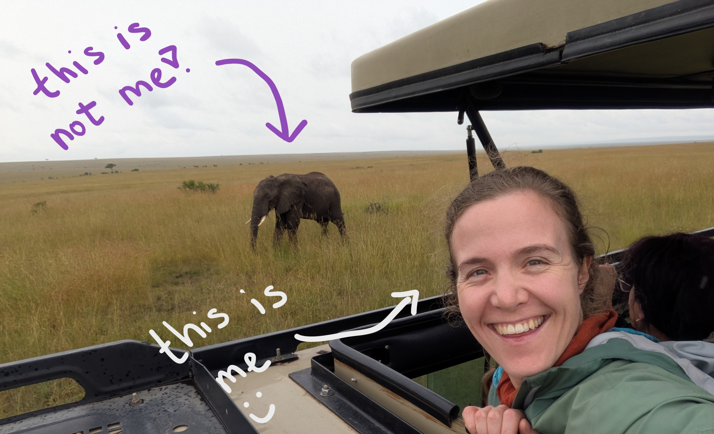

Projects with Jenni
===================================

Tips and tricks for BSc and MSc projects
with `Jenni Rinker <https://orbit.dtu.dk/en/persons/jennifer-marie-rinker>`_.
See table of contents below for more information.

|

.. note::

   These docs are a work in progress. 
   The source code is `here on GitHub <https://github.com/jennirinker/projects-with-jenni/tree/main>`_.

Contents
--------

.. toctree::

   project_registration
   onboarding
   project_management
   project_plan
   literature_survey
   final_report
   defense
   improve
